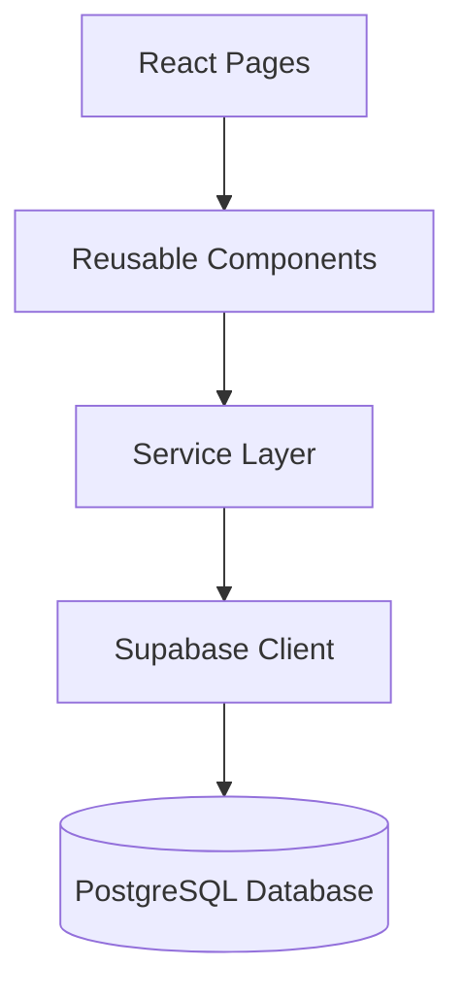
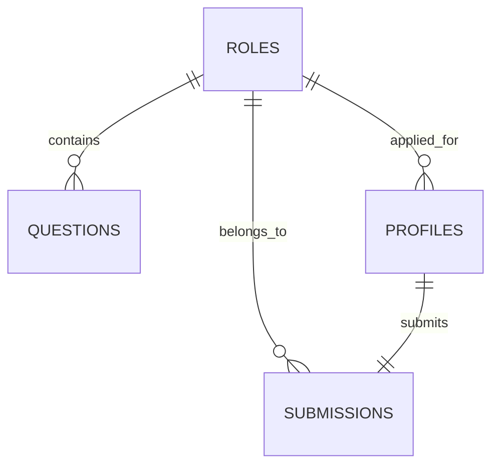
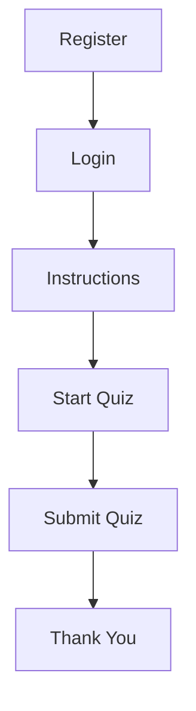
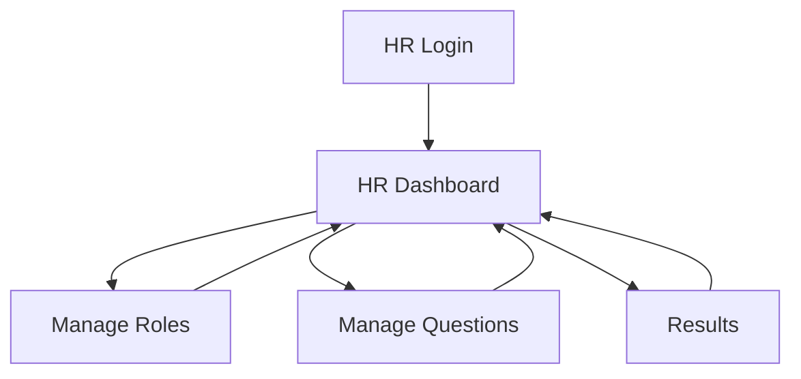
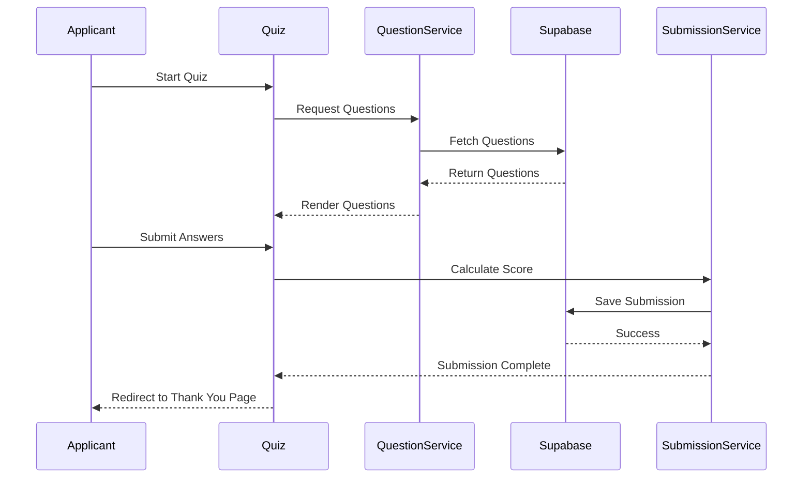

<div align="center">

# 🚀 Hell Craft Tech Talent Screening Platform
### Production-Ready Role-Based Online Assessment Platform

A modern, secure and scalable Talent Screening Platform built for **Hell Craft Technologies** using **React, JavaScript, Tailwind CSS and Supabase**.

Designed to simplify the recruitment process by enabling HR teams to manage roles, create assessments, evaluate candidates and review detailed submission results through a centralized dashboard.

---


</div>

---

# 📑 Table of Contents

- Project Overview
- Why This Project?
- Key Features
- Technology Stack
- System Architecture
- Folder Structure
- Database Design
- Authentication & RBAC
- Applicant Workflow
- HR Workflow
- Dashboard
- Role Management
- Question Management
- Quiz Engine
- Results Management
- Responsive Design
- Security
- Performance Optimizations
- Installation
- Environment Variables
- Deployment
- Screenshots
- Future Roadmap
- License

---

# 📌 Project Overview

The **Hell Craft Talent Screening Platform** is a full-stack recruitment assessment system designed to streamline the hiring workflow for organizations.

Instead of manually sending question papers and checking responses, HR teams can create technical assessments, assign applicants to specific job roles, monitor submissions, and evaluate candidate performance from a centralized dashboard.

Applicants receive a guided assessment experience including role-based instructions, timed quizzes, automatic evaluation, and secure submission handling.

The application follows a **production-style layered architecture**, separating presentation logic, business logic, and database operations to ensure maintainability, scalability, and clean code practices.

---

# 🎯 Why This Project?

Traditional hiring assessments often involve multiple manual steps:

- Creating question papers
- Sending assessments manually
- Tracking candidates
- Checking answers
- Calculating scores
- Maintaining spreadsheets

This platform automates the entire process.

HR administrators can:

- Create job roles
- Configure quiz duration
- Manage question banks
- Import questions using CSV
- Review candidate submissions
- Search and filter results
- Soft deactivate roles
- Bulk manage questions

Applicants experience a guided and secure assessment workflow with automatic score calculation and submission.

---

# ✨ Key Features

## 👨‍💼 HR Portal

- Secure HR Authentication
- Responsive Dashboard
- Dashboard Statistics
- Recent Activity
- Role Management
- Soft Delete (Active / Inactive Roles)
- Create & Edit Roles
- Configurable Quiz Duration
- Question CRUD
- CSV Question Import
- Bulk Question Delete
- Search Questions
- Filter Questions
- Candidate Results
- Search Results
- Filter Results
- Responsive Tables
- Toast Notifications
- Confirmation Dialogs

---

## 👨‍🎓 Applicant Portal

- Secure Registration
- Role Selection
- Login
- Instructions Page
- Timed Quiz
- Multiple Choice Questions
- Progress Tracking
- Automatic Score Calculation
- Duplicate Submission Prevention
- Thank You Page
- Mobile Friendly Experience

---

# 🛠 Technology Stack

| Category | Technology |
|----------|------------|
| Frontend | React 19 |
| Language | JavaScript (ES2024) |
| Styling | Tailwind CSS |
| Routing | React Router |
| Backend | Supabase |
| Database | PostgreSQL |
| Authentication | Supabase Auth |
| Icons | Lucide React |
| Notifications | React Hot Toast |
| Build Tool | Vite |
| Deployment | Vercel |

---

# 🏗 System Architecture

```text
                Applicant
                     │
                     │
               React Frontend
                     │
      ┌──────────────┴──────────────┐
      │                             │
 HR Dashboard                Applicant Portal
      │                             │
      └──────────────┬──────────────┘
                     │
              Service Layer
                     │
             Supabase Client
                     │
               PostgreSQL
```

The project follows a clean layered architecture.

### Presentation Layer

Responsible for rendering UI and handling user interactions.

Examples:

- Login
- Dashboard
- Quiz
- Results
- Manage Roles
- Manage Questions

---

### Service Layer

Contains all database communication.

Responsibilities include:

- CRUD operations
- Authentication
- Data fetching
- Query optimization

No React page directly communicates with Supabase.

---

### Database Layer

Supabase PostgreSQL stores:

- Roles
- Questions
- Profiles
- Quiz Submissions

All relationships are maintained using foreign keys.

---

# ⭐ Project Highlights

✅ Production-ready architecture

✅ Fully Responsive

✅ Role Based Access Control

✅ Supabase Authentication

✅ Service Layer Pattern

✅ Clean Component Structure

✅ CSV Question Import

✅ Bulk Delete

✅ Soft Delete

✅ Search & Filtering

✅ Toast Notifications

✅ Protected Routes

✅ Responsive Dashboard

✅ Mobile Optimized

✅ Scalable Folder Structure

✅ Beginner Friendly Codebase

---
# 📂 Project Structure

The project follows a clean, modular, and production-oriented architecture using **React**, **Supabase**, and **Tailwind CSS**. Responsibilities are separated into reusable UI components, pages, services, routing, and utilities to ensure maintainability and scalability.

```text
HCT_TalentScreening
│
├── public/
│   └── hct-logo.png
│
├── src/
│   │
│   ├── components/
│   │   ├── layout/
│   │   │   └── HRLayout.jsx
│   │   ├── Card.jsx
│   │   ├── ConfirmationModal.jsx
│   │   ├── EmptyState.jsx
│   │   ├── ErrorBoundary.jsx
│   │   ├── LoadingSpinner.jsx
│   │   ├── ProtectedRoute.jsx
│   │   ├── Skeleton.jsx
│   │   └── StatusBadge.jsx
│   │
│   ├── lib/
│   │   └── supabase.js
│   │
│   ├── pages/
│   │   ├── ApplicantDashboard.jsx
│   │   ├── HRDashboard.jsx
│   │   ├── Instructions.jsx
│   │   ├── Login.jsx
│   │   ├── ManageQuestions.jsx
│   │   ├── ManageRoles.jsx
│   │   ├── NotFound.jsx
│   │   ├── Quiz.jsx
│   │   ├── Register.jsx
│   │   ├── Results.jsx
│   │   └── ThankYou.jsx
│   │
│   ├── routes/
│   │   └── AppRoutes.jsx
│   │
│   ├── services/
│   │   ├── authService.js
│   │   ├── questionService.js
│   │   ├── roleService.js
│   │   └── submissionService.js
│   │
│   ├── utils/
│   │   └── toast.js
│   │
│   ├── App.jsx
│   ├── index.css
│   └── main.jsx
│
├── .env
├── .gitignore
├── eslint.config.js
├── index.html
├── package.json
├── package-lock.json
├── README.md
└── vite.config.js
```

---

# 📁 Folder Responsibilities

## 📦 components/

Contains reusable UI components shared across the application.

Examples include:

- HR Layout
- Cards
- Confirmation Modals
- Empty States
- Skeleton Loaders
- Error Boundary
- Status Badges
- Protected Route Wrapper

---

## 📄 pages/

Contains all application pages.

### Applicant Module

- Login
- Register
- Applicant Dashboard
- Instructions
- Quiz
- Thank You

### HR Module

- Dashboard
- Manage Roles
- Manage Questions
- Results

### Shared

- Not Found (404)

---

## ⚙️ services/

Contains all business logic and Supabase database operations.

Responsibilities:

- Authentication
- CRUD Operations
- Role Management
- Question Management
- Submission Management

**No page communicates directly with Supabase.**

---

## 📚 lib/

Contains application configuration.

Currently includes:

- Supabase Client

---

## 🛣️ routes/

Reserved for route organization.

> **Note:** The current application uses **App.jsx** as the primary routing entry point. `AppRoutes.jsx` is retained for compatibility/reference.

---

## 🛠️ utils/

Contains reusable utility functions.

Current utility:

- Toast Notification Helper

---

# 🏛️ Software Architecture

The project follows a layered architecture where the presentation layer never communicates directly with the database.



---

# 🧱 Architecture Layers

## 🎨 Presentation Layer

Responsible for rendering the user interface.

Includes:

- Pages
- Components
- Layouts

Responsibilities:

- User Interaction
- Forms
- Navigation
- Responsive Layout
- Local State Management

---

## ⚙️ Service Layer

Acts as the business layer of the application.

Responsibilities:

- Database Communication
- Authentication
- CRUD Operations
- Error Handling
- Query Abstraction

---

## ☁️ Database Layer

Powered by **Supabase PostgreSQL**.

Stores:

- Roles
- Questions
- Profiles
- Quiz Submissions

---

# 🗄️ Database Design

The application revolves around four core tables.

---

## Roles

| Column | Description |
|---------|-------------|
| id | Primary Key |
| name | Role Name |
| description | Role Description |
| quiz_duration_minutes | Quiz Duration |
| is_active | Active / Inactive Status |

---

## Questions

| Column | Description |
|---------|-------------|
| id | Primary Key |
| role_id | Related Role |
| question | Question |
| option_a | Option A |
| option_b | Option B |
| option_c | Option C |
| option_d | Option D |
| correct_option | Correct Answer |

---

## Profiles

| Column | Description |
|---------|-------------|
| id | User ID |
| full_name | Applicant Name |
| email | Email |
| role | applicant / hr |
| application_role_id | Applied Role |

---

## Submissions

| Column | Description |
|---------|-------------|
| id | Submission ID |
| applicant_id | Applicant |
| role_id | Applied Role |
| score | Obtained Score |
| total_questions | Total Questions |
| submitted_at | Submission Timestamp |

---

# 🔗 Entity Relationship Diagram



---

# 🔐 Role Based Access Control (RBAC)

## 👨‍💼 HR

Permissions:

- Dashboard Access
- Create Roles
- Edit Roles
- Activate / Deactivate Roles
- Manage Questions
- CSV Question Import
- Bulk Delete Questions
- View Results
- Search & Filter Results

---

## 👨‍🎓 Applicant

Permissions:

- Register
- Login
- Read Instructions
- Attempt Quiz
- Submit Quiz
- View Thank You Page

Applicants cannot access HR modules.

---

# 🔒 Route Protection

Protected routes are secured using a reusable **ProtectedRoute** component.

Responsibilities:

- Authentication Verification
- Role Verification
- Unauthorized Redirect
- Secure Navigation

---

# 👨‍🎓 Applicant Workflow



---

# 👨‍💼 HR Workflow



---

# 📋 Quiz Lifecycle



---

# 🛡️ Security Model

The application implements multiple layers of security.

### Authentication

- Supabase Authentication

### Authorization

- Role Based Access Control

### Database Security

- Row Level Security (RLS)

### Route Security

- Protected Routes

### Data Integrity

- Foreign Keys
- Unique Constraints
- Soft Delete Strategy

### User Protection

- Duplicate Quiz Prevention
- Confirmation Dialogs
- Validation
- Error Boundary

---

# 📐 Engineering Principles

The project follows modern software engineering principles.

- Separation of Concerns
- Service Layer Architecture
- Component Reusability
- Single Responsibility Principle
- Responsive Design
- Mobile First Layout
- Production Ready UI
- Clean Folder Structure
- Minimal API Calls
- Maintainable Codebase
- Beginner Friendly Architecture
- Scalable Design

# ✨ Core Features

The Hell Craft Talent Screening Platform is designed to automate the recruitment assessment process while maintaining a clean, secure, and scalable architecture.

The application is divided into two major modules:

- HR Management Portal
- Applicant Assessment Portal

---

# 👨‍💼 HR Management Portal

The HR Portal serves as the administrative dashboard where recruiters can manage the complete hiring assessment lifecycle.

---

## 📊 HR Dashboard

The dashboard provides an overview of the platform through real-time statistics and quick navigation.

### Features

- Total Roles
- Active Roles
- Total Questions
- Total Applicants
- Total Submissions

### Dashboard Cards

Each statistics card acts as a shortcut.

Clicking a card redirects directly to the related management page.

Example:

| Card | Redirect |
|-------|----------|
| Total Roles | Manage Roles |
| Active Roles | Manage Roles |
| Total Questions | Manage Questions |

---

## 🧑‍💼 Role Management

HR can completely manage available job roles.

### Supported Operations

- Create Role
- Edit Role
- Activate Role
- Deactivate Role
- Configure Quiz Duration

Instead of permanently deleting roles, the platform implements **Soft Delete**.

Inactive roles:

- Cannot be selected by new applicants
- Remain linked to historical submissions
- Can be reactivated at any time

---

### Role Status

Every role contains an Active / Inactive state.

Visual indicators help HR quickly distinguish available roles.

Inactive roles are displayed with reduced emphasis while preserving historical data integrity.

---

## ❓ Question Management

Questions are organized role-wise.

Each role maintains an independent question bank.

Supported operations include:

- Create Question
- Update Question
- Delete Question
- Search Questions
- Filter by Role

---

### Bulk Question Selection

To simplify administration, HR can select multiple questions simultaneously.

Features include:

- Individual Selection
- Select All
- Selected Count
- Clear Selection
- Bulk Delete

Deletion is confirmed through a reusable confirmation dialog before execution.

---

### CSV Import

Question banks can be imported using CSV.

The importer performs validation before inserting data into the database.

Supported validations include:

- Missing fields
- Invalid options
- Invalid correct answer
- Incorrect role mapping

Only valid rows are inserted.

Invalid rows are skipped with proper feedback.

---

## 📈 Candidate Results

HR can review all applicant submissions from a centralized interface.

Each submission includes:

- Candidate Name
- Email Address
- Applied Role
- Score
- Percentage
- Submission Time

---

### Search & Filtering

Results can be filtered instantly without additional database requests.

Supported filters:

- Search by Candidate Name
- Search by Email
- Filter by Role

Filtering is performed completely on the client after the initial fetch.

---

### CSV Export

Submission records can be exported as CSV for reporting or further analysis.

The export preserves all visible records after search and filtering.

---

# 👨‍🎓 Applicant Portal

Applicants experience a streamlined assessment process.

---

## 📝 Registration

New applicants can create an account by providing:

- Full Name
- Email Address
- Password
- Desired Role

Only Active roles are displayed.

Inactive roles cannot receive new applications.

---

## 🔑 Authentication

Authentication is handled through Supabase Authentication.

Features include:

- Secure Login
- Password Validation
- Session Persistence
- Logout

---

## 📖 Instructions Page

Before starting an assessment, applicants receive clear instructions.

Displayed information includes:

- Selected Role
- Quiz Duration
- Number of Questions
- Assessment Rules

This ensures every applicant understands the assessment process before beginning.

---

## ⏱ Timed Assessment

Each role has an independently configurable timer.

The timer is managed automatically during the assessment.

When time expires:

- The quiz is submitted automatically.

---

## 🧠 Quiz Engine

Questions are displayed one at a time in a clean, distraction-free interface.

Features include:

- Multiple Choice Questions
- Progress Tracking
- Current Question Indicator
- Selected Answer Highlight
- Responsive Layout

---

## 📊 Automatic Evaluation

Scores are calculated immediately after submission.

The platform automatically compares applicant responses against the stored correct answers.

Manual evaluation is not required.

---

## 🚫 Duplicate Submission Prevention

Applicants are allowed only one submission.

Multiple layers prevent duplicate attempts:

- Database Constraints
- Submission Verification
- Route Protection

---

## ✅ Thank You Page

After successful submission, applicants are redirected to a confirmation screen.

This prevents accidental resubmission and provides clear completion feedback.

---

# 📱 Responsive User Experience

The platform is designed using a mobile-first approach.

Supported devices include:

- Desktop
- Laptop
- Tablet
- Mobile

Responsive improvements include:

- Collapsible Navigation
- Mobile Drawer
- Sticky Header
- Responsive Tables
- Horizontal Table Scrolling
- Adaptive Forms

No functionality is lost on smaller screens.

---

# 🎨 User Interface

The interface follows a clean and modern design language.

Key principles:

- Minimalistic Layout
- Consistent Spacing
- Reusable Components
- Accessible Navigation
- Professional Color Palette
- Responsive Cards
- Interactive Tables

---

# 🔔 Toast Notifications

All important actions provide immediate user feedback through professional toast notifications.

Examples:

- Login Successful
- Registration Successful
- Role Updated
- Question Deleted
- CSV Imported
- Export Completed
- Validation Errors

Toast notifications replace intrusive browser alerts for a better user experience.

---

# ⚡ Performance Optimizations

Several optimizations improve responsiveness and scalability.

Implemented optimizations include:

- Service Layer Architecture
- Client-side Filtering
- Bulk Database Operations
- Component Reusability
- Skeleton Loading States
- Optimized Re-renders
- Lazy UI Rendering
- Minimal API Calls

---

# 🛡 Error Handling

The platform gracefully handles runtime and user errors.

Implemented strategies:

- Error Boundary
- Empty States
- Confirmation Modals
- Loading Indicators
- Inline Validation
- Toast Error Messages

This prevents unexpected crashes and improves overall reliability.

---

# 🌟 Production Highlights

✔ Service Layer Architecture

✔ Role Based Access Control (RBAC)

✔ Row Level Security (RLS)

✔ Responsive Dashboard

✔ Soft Delete Strategy

✔ Bulk Operations

✔ CSV Import

✔ CSV Export

✔ Search & Filtering

✔ Protected Routes

✔ Error Boundary

✔ Toast Notifications

✔ Skeleton Loading

✔ Reusable Components

✔ Mobile Friendly

✔ Clean Architecture

✔ Production Ready UI

✔ Scalable Codebase

✔ Beginner Friendly Structure

# 🚀 Getting Started

Follow the steps below to run the project locally.

---

## 1️⃣ Clone the Repository

```bash
git clone https://github.com/<your-username>/HCT_TalentScreening.git
```

---

## 2️⃣ Navigate to the Project

```bash
cd HCT_TalentScreening
```

---

## 3️⃣ Install Dependencies

```bash
npm install
```

---

## 4️⃣ Configure Environment Variables

Create a `.env` file in the project root.

```env
VITE_SUPABASE_URL=YOUR_SUPABASE_URL
VITE_SUPABASE_ANON_KEY=YOUR_SUPABASE_ANON_KEY
```

---

## 5️⃣ Start Development Server

```bash
npm run dev
```

---

## 6️⃣ Production Build

```bash
npm run build
```

---

## 7️⃣ Preview Production Build

```bash
npm run preview
```

---

# 🗂 Environment Variables

The application currently requires the following variables.

| Variable | Description |
|----------|-------------|
| VITE_SUPABASE_URL | Supabase Project URL |
| VITE_SUPABASE_ANON_KEY | Supabase Anonymous API Key |

---

# 🌐 Deployment

The project is deployment-ready and can be hosted on modern frontend platforms.

### Recommended Platforms

- Vercel
- Netlify

---

### Backend

Supabase

- Authentication
- PostgreSQL Database
- Row Level Security
- API Layer

---

# 🧪 Testing Checklist

Before deploying, verify the following.

## Authentication

- Login
- Register
- Logout
- Session Persistence

---

## HR Module

- Dashboard Statistics
- Create Role
- Update Role
- Activate Role
- Deactivate Role
- Search Roles

---

## Question Management

- Create Question
- Update Question
- Delete Question
- Bulk Delete
- Search
- Filter
- CSV Import

---

## Applicant Module

- Registration
- Login
- Instructions
- Quiz
- Timer
- Submission
- Thank You Page

---

## Results

- Search
- Filter
- CSV Export
- Percentage Calculation

---

## UI

- Mobile Responsive
- Desktop Responsive
- Loading States
- Empty States
- Confirmation Dialogs
- Toast Notifications

---

# 📊 Technical Highlights

## Frontend

- React 19
- JavaScript (ES2023)
- Tailwind CSS
- React Router
- React Hot Toast
- Lucide React

---

## Backend

- Supabase Authentication
- Supabase PostgreSQL

---

## Architecture

- Layered Architecture
- Service Layer Pattern
- Component-Based Design
- Protected Routes
- RBAC
- RLS

---

# 🛣 Future Improvements

Potential future enhancements include:

- HR Analytics Dashboard
- Question Difficulty Levels
- Candidate Ranking System
- AI-Based Resume Screening
- AI Question Generation
- Email Notifications
- Multi-Round Assessments
- Interview Scheduling
- Audit Logs
- Advanced Reports
- Pagination
- Dark Mode
- Multi-Tenant Support
- Internationalization (i18n)
- Role Permissions Management

---

# 🤝 Contributing

Contributions are welcome.

If you'd like to improve the project:

1. Fork the repository.
2. Create a new feature branch.

```bash
git checkout -b feature/your-feature
```

3. Commit your changes.

```bash
git commit -m "Add new feature"
```

4. Push your branch.

```bash
git push origin feature/your-feature
```

5. Open a Pull Request.

---

# 📄 License

This project is intended for educational and demonstration purposes.

Feel free to use it for learning, portfolio showcasing, and experimentation.

---

# 👨‍💻 Developer

**Ayush**

BCA Student | Full Stack Developer

Tech Stack:

- React
- JavaScript
- Tailwind CSS
- Node.js
- Supabase
- PostgreSQL
- Git & GitHub

---

# 💡 Key Learnings

Building this project provided hands-on experience with:

- Designing scalable React applications
- Implementing Role-Based Access Control (RBAC)
- Working with Row Level Security (RLS)
- Structuring applications using a Service Layer
- Managing authentication with Supabase
- Performing CRUD operations
- Bulk database operations
- CSV import and export workflows
- Responsive dashboard development
- Production-ready UI/UX practices
- Component reusability
- Error handling strategies
- State management using React Hooks
- Clean code principles

---

# ⭐ Why This Project?

This project demonstrates the implementation of a modern recruitment assessment platform that emphasizes clean architecture, maintainability, security, and user experience.

It showcases real-world software engineering concepts such as layered architecture, RBAC, RLS, reusable components, responsive design, service-oriented development, and production-ready workflows while remaining approachable for developers learning full-stack application development.

---

## 📸 Screenshots

> Add screenshots of the following pages after deployment:

- Login Page
- Register Page
- HR Dashboard
- Manage Roles
- Manage Questions
- Results
- Quiz Interface
- Thank You Page

---

## 🙏 Acknowledgements

Special thanks to the open-source community and the teams behind:

- React
- Vite
- Tailwind CSS
- Supabase
- Lucide React
- React Hot Toast

Their tools made the development of this project possible.

---

# ⭐ Support

If you found this project helpful:

- Star the repository ⭐
- Fork the project 🍴
- Share feedback 💬

Your support is greatly appreciated.

---

<div align="center">

## 🚀 HCT Talent Screening Platform

**Built with ❤️ using React, Supabase, and Tailwind CSS**

*A production-ready role-based recruitment assessment platform.*

</div>
